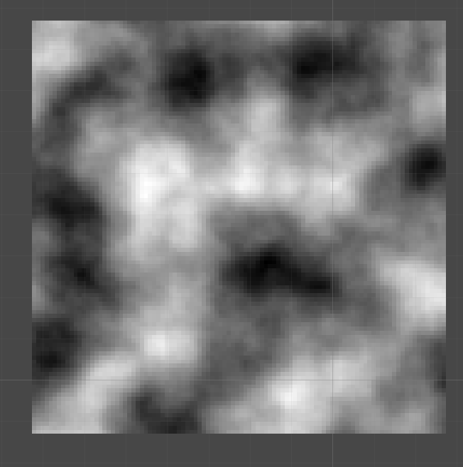

## PerlinNoiseMapGen

A 2D procedurally generated map created by perlin noise using C# and Unity.

Generates a noise map using the built in Mathf.perlinnoise function in C#.

Noise Map:

Then applies colours and creates certain regions (a region can be a range of values, for example: region water range (0,.5))

Example of map generation: (continually changing seed)

